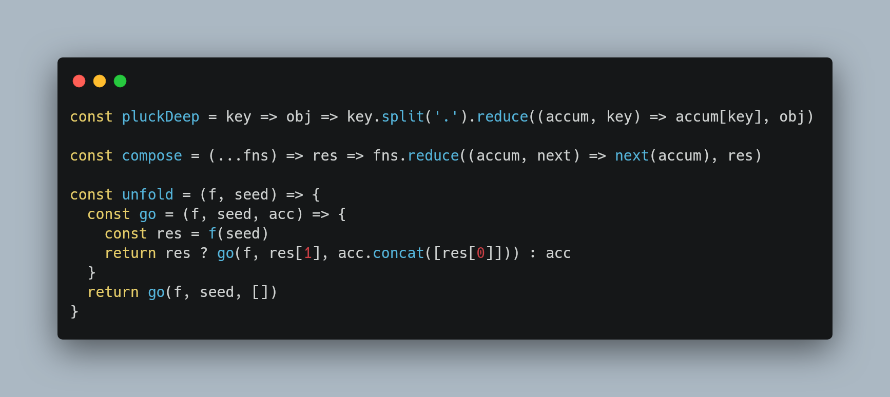
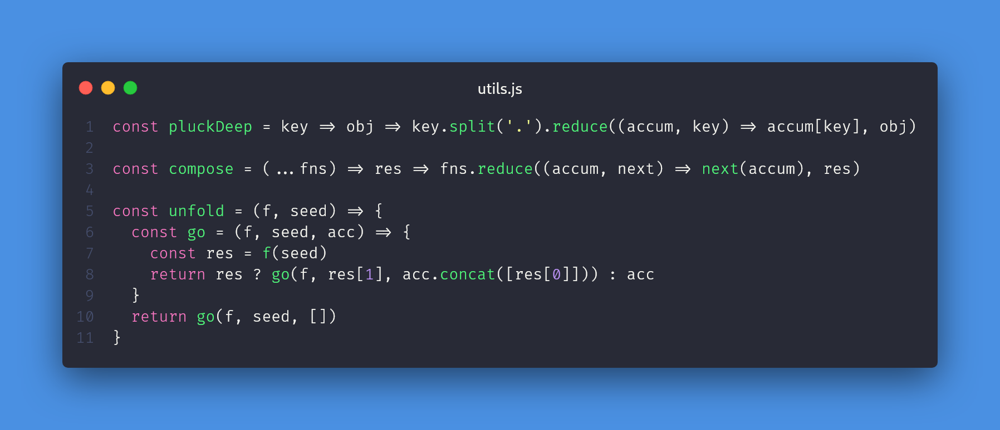
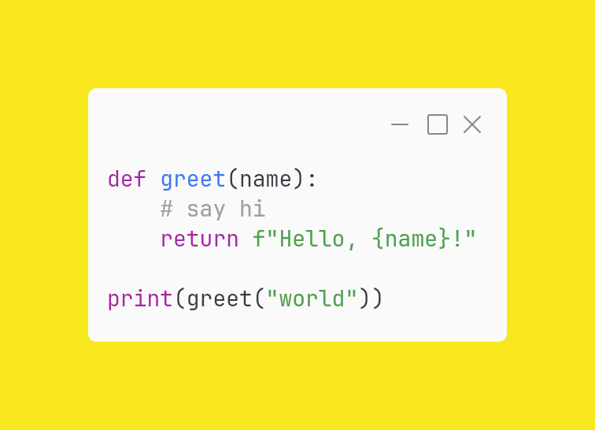

# carbon-canvas

Bikin gambar kode cantik ala [carbon.now.sh](https://carbon.now.sh) langsung dari **Node.js**, tanpa browser, tanpa Puppeteer, tanpa Chromium.

Render pakai [`@napi-rs/canvas`](https://github.com/Brooooooklyn/canvas) (Skia, prebuilt, tanpa dependency sistem) dan syntax highlight pakai [`highlight.js`](https://highlightjs.org). Tema, ukuran layout, shadow, dan window controls diambil dari source code [carbon-app/carbon](https://github.com/carbon-app/carbon).







## Fitur

- 29 tema bawaan Carbon (seti, dracula, monokai, nord, one-dark, dll)
- Auto detect bahasa (subset yang sama dengan Carbon) atau tentukan manual
- 3 font monospace bawaan: Hack, Fira Code (ligatures), JetBrains Mono
- Window controls gaya macOS, `bw`, atau `boxy`, plus judul window
- Line numbers dengan nomor awal custom
- Drop shadow, padding, warna background (atau transparan)
- Export resolusi tinggi (default 2x, sama seperti Carbon)
- Sinkron, cepat, output `Buffer` PNG siap kirim (bot WhatsApp/Telegram/Discord, API, dll)

## Instalasi

```bash
git clone https://github.com/cabrata/carbon-canvas.git
cd carbon-canvas
npm install
```

Atau install langsung dari GitHub ke project kamu:

```bash
npm install github:cabrata/carbon-canvas
```

Butuh Node.js 18 ke atas.

## Pemakaian

```js
const fs = require('fs')
const { render } = require('carbon-canvas')

const code = `function hello(name) {
  return \`Hello, \${name}!\`
}`

const png = render(code, { language: 'javascript' })
fs.writeFileSync('code.png', png)
```

Contoh dengan opsi lengkap:

```js
const png = render(code, {
  theme: 'dracula',
  language: 'javascript',
  fontFamily: 'Fira Code',
  fontSize: 14,
  lineHeight: 1.33,
  lineNumbers: true,
  firstLineNumber: 1,
  title: 'utils.js',
  windowControls: true,
  windowTheme: 'none',
  backgroundColor: 'rgba(74,144,226,1)',
  paddingVertical: 56,
  paddingHorizontal: 56,
  dropShadow: true,
  dropShadowOffsetY: 20,
  dropShadowBlurRadius: 68,
  scale: 2,
})
```

### Contoh: Express API

```js
const express = require('express')
const { render } = require('carbon-canvas')

const app = express()
app.use(express.json({ limit: '100kb' }))

app.post('/carbon', (req, res) => {
  try {
    res.type('png').send(render(req.body.code, req.body.options))
  } catch (e) {
    res.status(400).json({ error: e.message })
  }
})

app.listen(3000)
```

## API

### `render(code, options?) => Buffer`

Render `code` (string) jadi PNG. Melempar error kalau `code` bukan string atau tema tidak ditemukan.

| Opsi | Tipe | Default | Keterangan |
| --- | --- | --- | --- |
| `theme` | `string \| object` | `'seti'` | ID tema (lihat daftar di bawah) atau objek tema custom |
| `language` | `string` | `'auto'` | Nama bahasa highlight.js (`javascript`, `python`, `go`, ...) atau `'auto'` |
| `fontFamily` | `string` | `'Hack'` | `Hack`, `Fira Code`, `JetBrains Mono`, atau font yang didaftarkan via `registerFont` |
| `fontSize` | `number` | `14` | Ukuran font (px) |
| `lineHeight` | `number` | `1.33` | Pengali tinggi baris |
| `lineNumbers` | `boolean` | `false` | Tampilkan nomor baris |
| `firstLineNumber` | `number` | `1` | Nomor baris pertama |
| `windowControls` | `boolean` | `true` | Tampilkan tombol window |
| `windowTheme` | `string` | `'none'` | `none` (warna macOS), `bw` (outline), `boxy` (gaya Windows) |
| `title` | `string` | `''` | Judul di tengah title bar |
| `backgroundColor` | `string` | `'rgba(171, 184, 195, 1)'` | Warna CSS apapun, atau `'transparent'` |
| `paddingVertical` | `number` | `56` | Padding atas bawah (px) |
| `paddingHorizontal` | `number` | `56` | Padding kiri kanan (px) |
| `dropShadow` | `boolean` | `true` | Shadow di bawah window |
| `dropShadowOffsetY` | `number` | `20` | Offset Y shadow (px) |
| `dropShadowBlurRadius` | `number` | `68` | Blur shadow (px) |
| `scale` | `number` | `2` | Skala export (1x, 2x, 4x) |
| `minWidth` | `number` | `90` | Lebar minimal window (px) |
| `maxWidth` | `number` | `1024` | Lebar maksimal window (px), baris lebih panjang akan terpotong |

### `THEMES`

Array semua tema `{ id, name, highlights }`.

### `DEFAULTS`

Objek opsi default.

### `FONTS`

Array nama font bawaan.

### `registerFont(path, name)`

Daftarkan font TTF/OTF sendiri:

```js
const { render, registerFont } = require('carbon-canvas')
registerFont('./fonts/CascadiaCode.ttf', 'Cascadia Code')
render(code, { fontFamily: 'Cascadia Code' })
```

## Tema

Lihat preview semua tema di **[THEMES.md](THEMES.md)**.

`3024-night`, `a11y-dark`, `blackboard`, `base16-dark`, `base16-light`, `cobalt`, `dracula`, `duotone-dark`, `hopscotch`, `lucario`, `material`, `monokai`, `night-owl`, `nord`, `oceanic-next`, `one-light`, `one-dark`, `panda-syntax`, `paraiso-dark`, `seti`, `shades-of-purple`, `solarized dark`, `solarized light`, `synthwave-84`, `twilight`, `verminal`, `vscode`, `yeti`, `zenburn`

### Tema custom

```js
render(code, {
  theme: {
    id: 'my-theme',
    highlights: {
      background: '#1e1e2e',
      text: '#cdd6f4',
      keyword: '#cba6f7',
      string: '#a6e3a1',
      number: '#fab387',
      comment: '#6c7086',
      definition: '#89b4fa',
      variable: '#f38ba8',
      property: '#89dceb',
      attribute: '#f9e2af',
      operator: '#94e2d5',
      meta: '#f5c2e7',
      tag: '#f38ba8',
    },
  },
})
```

Key yang tidak diisi akan pakai warna `text`.

## Tips

- Auto detect bisa salah tebak untuk snippet pendek (misal JS kebaca coffeescript). Isi `language` manual untuk hasil konsisten.
- Tab otomatis diubah jadi 2 spasi.
- Untuk background transparan pakai `backgroundColor: 'transparent'` dan biasanya `dropShadow: false`.

## Keterbatasan

- Belum ada word wrap, baris yang lebih lebar dari `maxWidth` akan terpotong.
- Belum support background image dan watermark.
- Hanya 3 font bawaan (Carbon punya 13), sisanya bisa ditambah lewat `registerFont`.

## Test

```bash
npm test
```

Menghasilkan contoh gambar di folder `out/`.

## Kredit

- Tema, layout, dan desain dari [Carbon](https://github.com/carbon-app/carbon) oleh Dawn Labs (MIT)
- Font: [Hack](https://github.com/source-foundry/Hack) (MIT/Bitstream Vera), [Fira Code](https://github.com/tonsky/FiraCode) (OFL 1.1), [JetBrains Mono](https://github.com/JetBrains/JetBrainsMono) (OFL 1.1)

## Lisensi

MIT
